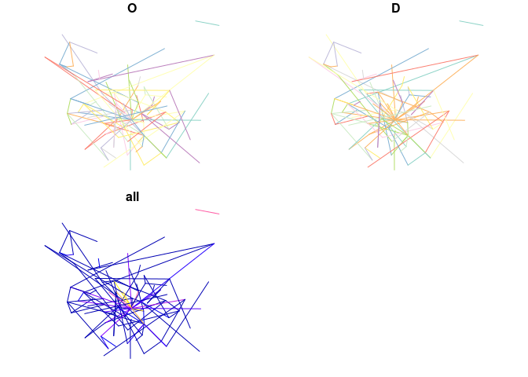
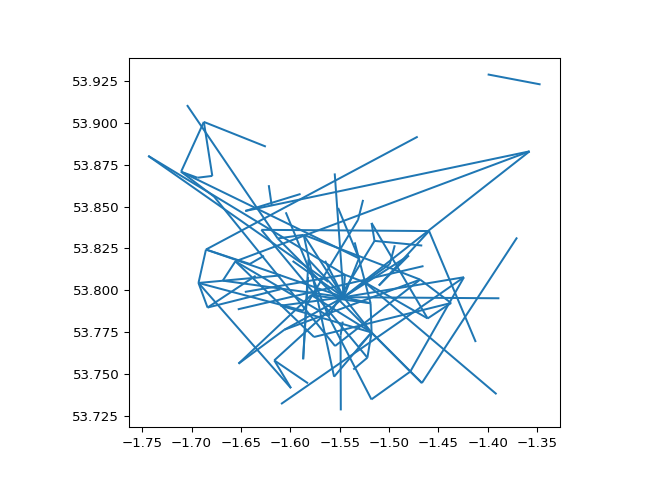
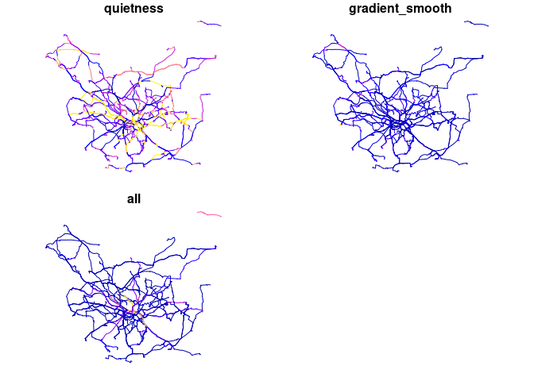
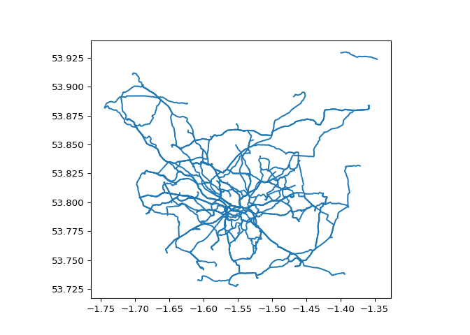
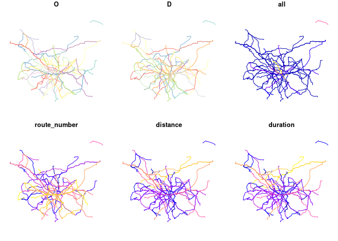
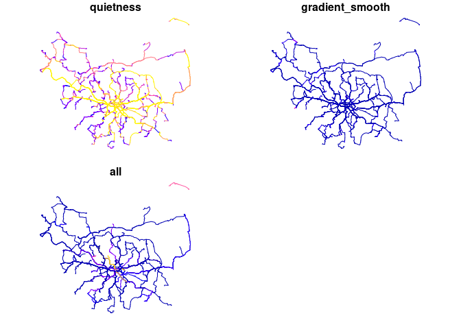

# Transport Data Mini Hack: Routing Engines

As part of the the [Network Planning Tool for
Scotland](https://nptscot.github.io) project, we are looking to explore
different options for routing and associated data processing tasks.

We’ll run this session in 1 pars:

## Part 1: Data pre-processing and idea generation, 10:00-13:00

This will done asynchronously, with participants working alone or
in-person to generate input datasets and discuss needs.

## Part 2: Development and hacking, 14:00-16:00

This will be the ‘hackathon’ part of the day, where people will work
alone or in groups synchronously to develop code and test routing
solutions. We will set-up Microsoft Teams for anyone to contribute
remotely.

## Hack ideas

- Benchmarking different engines in terms of ease of setup, with
  Valhalla, Graphhopper, OSRM, and
  [AequilibraE](https://www.outerloop.io/blog/20240729_route_choice/)
  and any other open source routing engine being options
  - As a ballpark for performance levels of current code we’re getting
    around:
    - 1-5 routes per second for one-by-one API requests
    - 30-100 routes per second for batch routing with CycleStreets
    - ??? Can we go faster while retaining valuable route level info ???
      See `od2net` for an example of fast network generation
    - Can we keep summary stats on origin and destination groups? See
      https://github.com/Urban-Analytics-Technology-Platform/od2net/issues/35
- Obtaining segment-level data from route-level data, overcoming an
  issue with the NPT workflow in which duplicate segments are
  represented multiple times (if that makes sense…)
  - That could involve spatial joins, e.g. with
    https://github.com/nptscot/rnetmatch or other packages
- Ease of customising routing weights
- Network pre-processing, with reference to existing documentation,
  e.g. from
  [sDNA](https://sdna-plus.readthedocs.io/en/latest/network_preparation.html)

## Logistics

We have in-person space at the University of Leeds from 10:00, get in
touch if you’d like to join remotely or in person if you don’t know
where to find us.

## Sharing code

You can put code whereever you like but please do share reproducible
examples with a link to your code and by putting the code here directly
with pull requests to this repository. We will share input datasets in
the Releases of this repository.

**Please create issues describing ideas before putting in PRs.**

See specific guidance on opening issues and associated Pull Requests
here:
https://github.com/ITSLeeds/routingday/blob/main/test_osmnx_rl.md#how-to-contribute-to-the-repo

## Getting started

To get the input datasets and example code, first install the `gh`
command line tool, then run:

``` bash
gh repo clone itsleeds/routingday
```

## Input datasets

The input datasets in this repo were created with the following
packages:

``` r
library(tidyverse)
```

    ── Attaching core tidyverse packages ──────────────────────── tidyverse 2.0.0 ──
    ✔ dplyr     1.1.4     ✔ readr     2.1.5
    ✔ forcats   1.0.0     ✔ stringr   1.5.1
    ✔ ggplot2   3.5.1     ✔ tibble    3.2.1
    ✔ lubridate 1.9.3     ✔ tidyr     1.3.1
    ✔ purrr     1.0.2     
    ── Conflicts ────────────────────────────────────────── tidyverse_conflicts() ──
    ✖ dplyr::filter() masks stats::filter()
    ✖ dplyr::lag()    masks stats::lag()
    ℹ Use the conflicted package (<http://conflicted.r-lib.org/>) to force all conflicts to become errors

``` r
library(sf)
```

    Linking to GEOS 3.12.1, GDAL 3.8.4, PROJ 9.3.1; sf_use_s2() is TRUE

### Origin-destination data

You can get this in some countries (UK, Republic of Ireland, USA for
example) from census data. You can also simulate it (e.g. for travel to
school, shops and other purposes) and that could be a topic for your
hack, although the main focus is on routing. In the NPT project we use
Census data for travel to work and data on travel to school for school
travel. We simulate travel to shops, leisure and personal trips with a
spatial interaction model.

``` r
remotes::install_dev("simodels")
od_data_leeds = simodels::si_od_census
names(od_data_leeds)
od_data_leeds = od_data_leeds |>
  filter(O != D) |>
  select(O, D, all)
zones_msoa_leeds = simodels::si_zones
set.seed(42)
od_data_100 = od_data_leeds |>
  sample_n(100, weight = all)
od_data_100_sf = od::od_to_sf(od_data_100, zones_msoa_leeds)
# Save to input_data folder:
dir.create("input_data")
sf::write_sf(zones_msoa_leeds, "input_data/zones_msoa_leeds.geojson", delete_dsn = TRUE)
sf::write_sf(od_data_100_sf, "input_data/od_data_100_sf.geojson", delete_dsn = TRUE)
readr::write_csv(od_data_100, "input_data/od_data_100.csv")
```

We can read-in and visualise the data with R as follows:

``` r
od_geo = sf::read_sf("input_data/od_data_100_sf.geojson")
plot(od_geo)
```



Let’s visualise the OD data in Python:

``` python
import geopandas as gpd
od_gdf = gpd.read_file("input_data/od_data_100_sf.geojson")
od_gdf.plot()
```



## Basic routing

There are many ways to generate routes from this OD data and that’s the
focus of this event. For the NPT project we use an external web service
hosted by CycleStreets.net. You can generate routes from
CycleStreets.net as follows (note: requires API key):

``` r
library(stplanr)
routes_1 = route(
    l = od_geo,
    route_fun = cyclestreets::journey,
    plan = "fastest"
)
sf::write_sf(routes_1, "input_data/routes_1.geojson", delete_dsn = TRUE)
```

We can visualise the route data as follows:

``` r
routes_1 = sf::read_sf("input_data/routes_1.geojson")
names(routes_1)
```

     [1] "O"                  "D"                  "all"               
     [4] "route_number"       "id"                 "time"              
     [7] "busynance"          "quietness"          "signalledJunctions"
    [10] "signalledCrossings" "name"               "walk"              
    [13] "elevations"         "distances"          "type"              
    [16] "legNumber"          "distance"           "turn"              
    [19] "startBearing"       "color"              "provisionName"     
    [22] "start"              "finish"             "start_longitude"   
    [25] "start_latitude"     "finish_longitude"   "finish_latitude"   
    [28] "crow_fly_distance"  "event"              "whence"            
    [31] "speed"              "itinerary"          "plan"              
    [34] "note"               "length"             "west"              
    [37] "south"              "east"               "north"             
    [40] "leaving"            "arriving"           "grammesCO2saved"   
    [43] "calories"           "edition"            "gradient_segment"  
    [46] "elevation_change"   "gradient_smooth"    "geometry"          

``` r
nrow(routes_1)
```

    [1] 2973

``` r
routes_1 |>
  select(quietness, gradient_smooth, all) |>
  plot()
```



``` r
#   tm_shape() +
#   tm_lines("all")
```

``` python
import geopandas as gpd
routes_1_gdf = gpd.read_file("input_data/routes_1.geojson")
```

    /home/robin/.virtualenvs/r-reticulate/lib/python3.10/site-packages/pyogrio/geopandas.py:49: FutureWarning: errors='ignore' is deprecated and will raise in a future version. Use to_datetime without passing `errors` and catch exceptions explicitly instead
      res = pd.to_datetime(ser, **datetime_kwargs)
    /home/robin/.virtualenvs/r-reticulate/lib/python3.10/site-packages/pyogrio/geopandas.py:49: FutureWarning: errors='ignore' is deprecated and will raise in a future version. Use to_datetime without passing `errors` and catch exceptions explicitly instead
      res = pd.to_datetime(ser, **datetime_kwargs)

``` python
routes_1_gdf.plot();
```



There are many ways to generate routes but few are easy. For ‘good’
quality routes you often need an API key which, when used to generate
many routes, can be expensive (e.g. Google, Graphopper). One service
that is free for small scale usage is OSRM’s public instance, which we
can call from R as follows:

``` r
library(stplanr)
system.time({
routes_2 = route(
    l = od_geo,
    route_fun = route_osrm,
    osrm.profile = "foot"
)
})
```

    Most common output is sf

       user  system elapsed 
     11.446   0.210  37.915 

``` r
nrow(routes_2)
```

    [1] 100

``` r
names(routes_2)
```

    [1] "O"            "D"            "all"          "route_number" "distance"    
    [6] "duration"     "geometry"    

``` r
plot(routes_2)
```



As the timing exercise shows, it took almost a minute to generate 100
routes.

**Challenge: get under 1 second**

A common requirement is to set routing profiles for different transport
modes and users. For cycle network planning, for example, your users may
be interested in the quietest routes. You can calculate those with
CycleStreets as follows:

``` r
library(stplanr)
routes_quietest = route(
    l = od_geo,
    route_fun = cyclestreets::journey,
    plan = "quietest"
)
sf::write_sf(routes_quietest, "input_data/routes_quietest.geojson", delete_dsn = TRUE)
```

``` r
routes_quietest = sf::read_sf("input_data/routes_quietest.geojson")
names(routes_quietest)
```

     [1] "O"                  "D"                  "all"               
     [4] "route_number"       "id"                 "time"              
     [7] "busynance"          "quietness"          "signalledJunctions"
    [10] "signalledCrossings" "name"               "walk"              
    [13] "elevations"         "distances"          "type"              
    [16] "legNumber"          "distance"           "turn"              
    [19] "startBearing"       "color"              "provisionName"     
    [22] "start"              "finish"             "start_longitude"   
    [25] "start_latitude"     "finish_longitude"   "finish_latitude"   
    [28] "crow_fly_distance"  "event"              "whence"            
    [31] "speed"              "itinerary"          "plan"              
    [34] "note"               "length"             "west"              
    [37] "south"              "east"               "north"             
    [40] "leaving"            "arriving"           "grammesCO2saved"   
    [43] "calories"           "edition"            "gradient_segment"  
    [46] "elevation_change"   "gradient_smooth"    "geometry"          

``` r
nrow(routes_quietest)
```

    [1] 5163

``` r
routes_quietest |>
  select(quietness, gradient_smooth, all) |>
  plot()
```



``` r
#   tm_shape() +
#   tm_lines("all")
```

### Batch routing

You can use the function `cyclestreets::batch()` for batch routing that
gives around a 10x speed-up.

# Routing using a local copy of OSM

…

## Notes

See the qmd for the source code that generated README.md: to check you
have R and Python installed you can try to reproduce it with:

``` bash
quarto render README.qmd
```

See the source code for scripts to convert the .qmd file to .R and .py
files.
