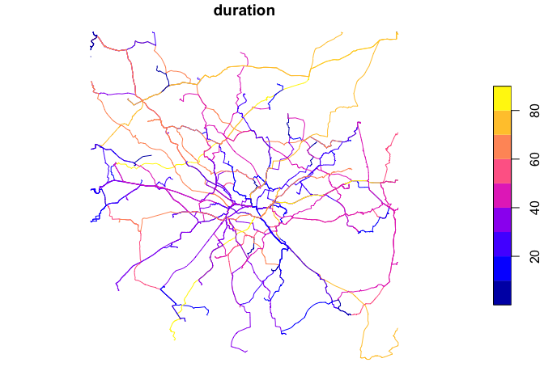

# OSRM first go

This focuses on setting a basic local OSRM routing server using the
default bicycle profile. Anyone is free to go further to potentially
explore the modification of profiles.

This was done on MacOS.

# Set up local OSRM

First, we need to set up a local server from shell. The references can
be found [here](https://github.com/Project-OSRM/osrm-backend).

There are some dependencies that should be installed first. I used brew,
which make it way easier.

``` bash
# pre-requisites
brew install cmake boost boost-python3 tbb libstxxl libxml2 bzip2 lua luajit libzip openssl pkg-config
```

Then, we clone the OSRM repo and build the software using a PBF file for
Leeds.

``` bash

# Clone osrm-backend from git
git clone https://github.com/Project-OSRM/osrm-backend.git
cd osrm-backend

# Make
mkdir -p build
cd build
export TBB_DIR=/usr/local/opt/tbb

cmake .. -DTBB_DIR=$TBB_DIR
make

# Get the road data for Leeds
cd ..
wget -O leeds.osm.pbf https://download.bbbike.org/osm/extract/planet_-1.6757,53.7141_-1.4287,53.879.osm.pbf

# extract the data with bicycle profile
./build/osrm-extract -p profiles/bicycle.lua leeds.osm.pbf

# partition
./build/osrm-partition leeds.osrm
./build/osrm-customize leeds.osrm
```

Finally, we run the instance.

``` bash
# Run instance
./build/osrm-routed --algorithm mld --port 5001 leeds.osrm --max-table-size 100000
```

With the instance active we go to R and specify the local host on
`osrm`.

# Excecute from R

So, we set the local host.

``` r
# Set environment variable to avoid fork safety issues on macOS
Sys.setenv(OBJC_DISABLE_INITIALIZE_FORK_SAFETY = "YES")

library(osrm)
```

    Data: (c) OpenStreetMap contributors, ODbL 1.0 - http://www.openstreetmap.org/copyright

    Routing: OSRM - http://project-osrm.org/

``` r
library(sf)
```

    Linking to GEOS 3.11.0, GDAL 3.5.3, PROJ 9.1.0; sf_use_s2() is TRUE

``` r
# Set local host
options(osrm.server = "http://localhost:5001/")
```

For this example, we use the OD data generated in the `README` file. So,
we read the data directly.

``` r
# Read OD points
od_geo <- sf::st_read("input_data/od_data_100_sf.geojson")
```

    Reading layer `od_data_100_sf' from data source 
      `/Users/rafa/Desktop/routingday/input_data/od_data_100_sf.geojson' 
      using driver `GeoJSON'
    Simple feature collection with 100 features and 3 fields
    Geometry type: LINESTRING
    Dimension:     XY
    Bounding box:  xmin: -1.743949 ymin: 53.72819 xmax: -1.346497 ymax: 53.92906
    Geodetic CRS:  WGS 84

Next, I prepare the OD into a suitable format to pass it to OSRM.

``` r
# Define OD points
origins <- lwgeom::st_startpoint(od_geo) 
origins <- sf::st_coordinates(origins)

destinations <- lwgeom::st_endpoint(od_geo) 
destinations <- sf::st_coordinates(destinations)
```

## Routing from local OSRM server

Now, to keep the SF geometries together with the distance and duration
estimates, I run one-to-one OD pair (parallel is causing troube in MD
environment). I am not sure if this is the best way to do it. Given that
OSRM has some multiprocessing capabilities internally, but so far, I am
not sure how to implement it from `R` while preserving all the
information.

``` r
# Run OD routes
system.time({
  osrm_routes <- lapply(1:nrow(origins), function(i) {
    route <- osrm::osrmRoute(
      src = origins[i,], 
      dst = destinations[i,], 
      overview = "full",
      osrm.profile = 'bicycle'
    )
    return(route)
  })
})
```

       user  system elapsed 
      0.215   0.009   1.116 

``` r
# bind rows
  osrm_routes <- dplyr::bind_rows(osrm_routes)
```

This takes about 1.4 in the quarto environment. However, in a parallel
processing is reduced to about 1 sec.

``` r
plot(osrm_routes[,3])
```


