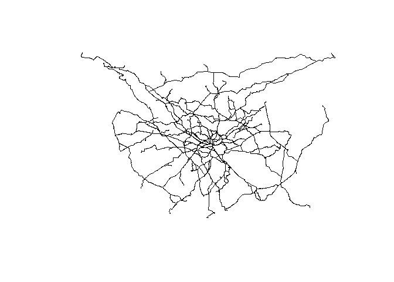

# OTP benchmark


The following code is to test the performance of the OTP routing engine
running locally controlled by the `opentripplanner` package with a
sample of Origins and Destinations

``` r
library(tidyverse)
```

    ── Attaching core tidyverse packages ──────────────────────── tidyverse 2.0.0 ──
    ✔ dplyr     1.1.4     ✔ readr     2.1.5
    ✔ forcats   1.0.0     ✔ stringr   1.5.1
    ✔ ggplot2   3.5.1     ✔ tibble    3.2.1
    ✔ lubridate 1.9.3     ✔ tidyr     1.3.1
    ✔ purrr     1.0.2     
    ── Conflicts ────────────────────────────────────────── tidyverse_conflicts() ──
    ✖ dplyr::filter() masks stats::filter()
    ✖ dplyr::lag()    masks stats::lag()
    ℹ Use the conflicted package (<http://conflicted.r-lib.org/>) to force all conflicts to become errors

We will read the OD data produced for this test

``` r
od_geo = sf::read_sf("input_data/od_data_100_sf.geojson")
```

Extracting Origins and Destinations with the `'lwgeom` package

``` r
origins <- lwgeom::st_startpoint(od_geo) |> sf::st_as_sf()
```

    Linking to GEOS 3.11.2, GDAL 3.8.2, PROJ 9.3.1; sf_use_s2() is TRUE

``` r
origins$O <- od_geo$O


destinations <- lwgeom::st_endpoint(od_geo) |> sf::st_as_sf()
destinations$D <- od_geo$D
```

### Setting up OTP

The following codes will prepare the folders and files that are required
for the OTP server to run

#### Creating the folder structure

We create a folder for the Leeds, which will be used as a router in the
OTP functions

``` r
dir.create("OTP/graphs/Leeds",recursive = T,showWarnings = F)
```

Using the `osmextract` package we can extract the OSM data

``` r
leeds_osm <- osmextract::oe_get("Leeds",
                                download_directory = "OTP/graphs/Leeds")
```

    No exact match found for place = Leeds and provider = geofabrik. Best match is Laos. 
    Checking the other providers.

    An exact string match was found using provider = bbbike.

    The chosen file was already detected in the download directory. Skip downloading.

    The corresponding gpkg file was already detected. Skip vectortranslate operations.

    Reading layer `lines' from data source 
      `C:\Users\ts18jpf\OneDrive - University of Leeds\03_PhD\00_Misc_projects\routingday\OTP\graphs\leeds\bbbike_Leeds.gpkg' 
      using driver `GPKG'
    Simple feature collection with 174124 features and 9 fields
    Geometry type: LINESTRING
    Dimension:     XY
    Bounding box:  xmin: -1.889999 ymin: 53.65 xmax: -1.280002 ymax: 53.88
    Geodetic CRS:  WGS 84

Loading the `opentripplanner`

``` r
library(opentripplanner)
```

Specifying the paths

``` r
path_data <- file.path("OTP")
path_otp <- otp_dl_jar(path_data,cache = T)
```

    Using cached version from C:/Users/ts18jpf/AppData/Local/R/win-library/4.4/opentripplanner/jar/otp-1.5.0-shaded.jar

Creating the config file for the router. For this purpose we are going
to use the default values

``` r
if(!file.exists("OTP/graphs/leeds/router-config.json")){
router_config <- otp_make_config("router")
otp_validate_config(router_config)
# router_config$routingDefaults$triangleSafetyFactor ### For quietness optimisation
# router_config$routingDefaults$$triangleTimeFactor ### For speed optimisation
otp_write_config(router_config,                # Save the config file
                 dir = path_data,
                 router = "Leeds")  
}
```

We could also save some GTFS data at this poing, if needed. For this
test we do not neet it, so we built the graph with the following code.

``` r
if(!file.exists("OTP/graphs/leeds/Graph.obj")){
log1 <- otp_build_graph(otp = path_otp,router = "Leeds", dir = path_data,memory = 15000)
}
```

We initialise the OTP server once the graph has been built

``` r
log2 <- otp_setup(otp = path_otp, dir = path_data,router = "Leeds",memory = 15e3)
```

    You have the correct version of Java for OTP 1.x

    2024-08-08 15:09:06.793926 OTP is loading and may take a while to be useable

    Router http://localhost:8080/otp/routers/Leeds exists

    2024-08-08 15:09:37.37493 OTP is ready to use Go to localhost:8080 in your browser to view the OTP

``` r
otpcon <- otp_connect(timezone = "Europe/London",router = "Leeds")
```

    Router http://localhost:8080/otp/routers/Leeds exists

Using the `otp_plan` function, we can generate the routes for the
origins and destinations. We will use `system.time` to measure the time
used for processing the routes

``` r
system.time({
routes2 <- otp_plan(otpcon = otpcon,
                    fromPlace = origins,
                    toPlace = destinations,
                    fromID = origins$O,
                    toID = destinations$D,
                    mode = "BICYCLE")
})
```

    2024-08-08 15:09:38.128524 sending 100 routes requests using 19 threads

    Done in 0 mins

    2024-08-08 15:09:40.157726 processing results

    8 routes returned errors. Unique error messages are:

    6x messages: "No trip found. There may be no transit service within the maximum specified distance or at the specified time, or your start or end point might not be safely accessible."

    2x messages: "We're sorry. The trip planner is temporarily unavailable. Please try again later."

    2024-08-08 15:09:40.77809 done

       user  system elapsed 
       0.09    0.00    2.78 

A quick look at the result

``` r
plot(routes2[,"geometry"])
```


